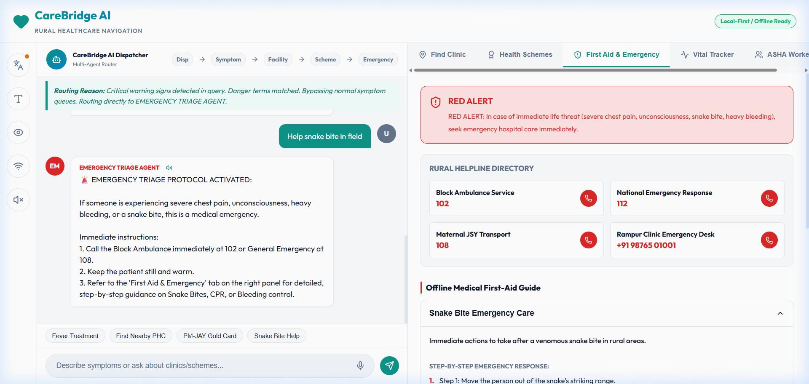
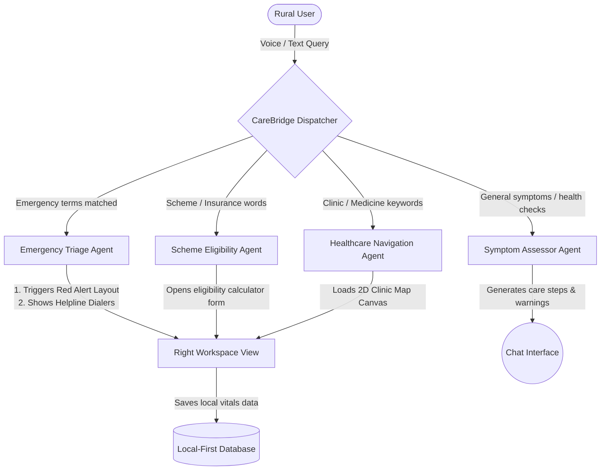
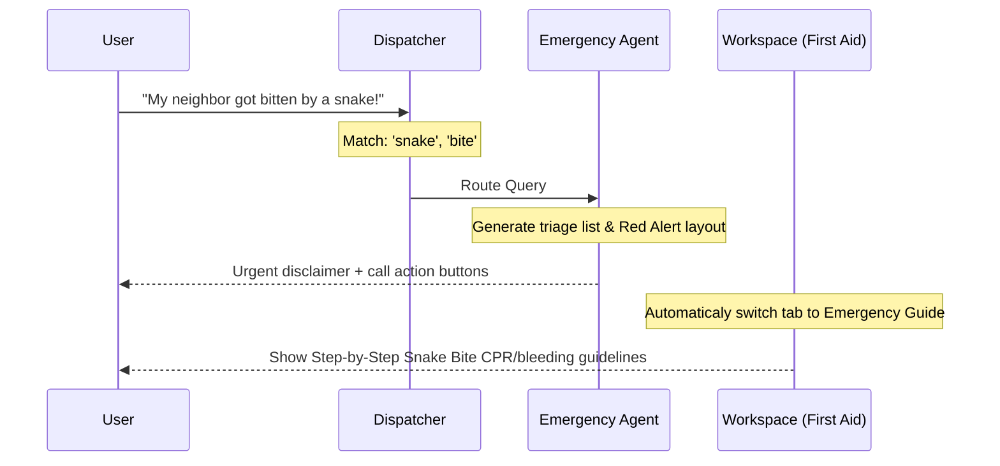
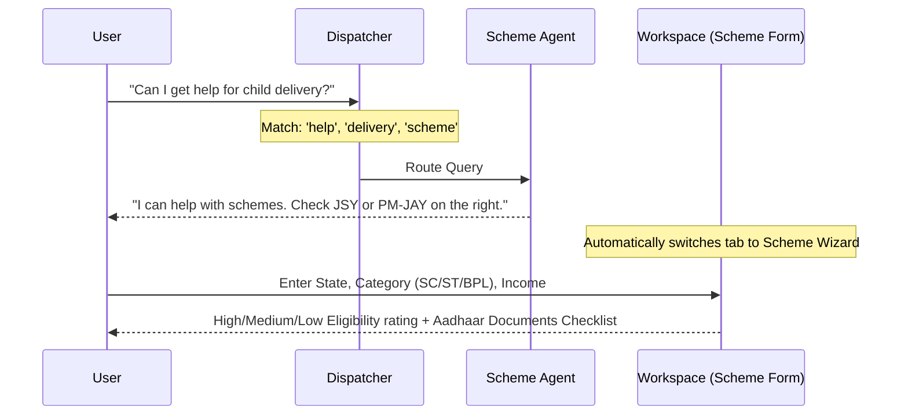

# CareBridge AI — Rural Healthcare Assistant & Navigation Agent



CareBridge AI is an accessible, multi-agent AI assistant built to help rural communities assess symptoms, search local healthcare facilities, evaluate eligibility for government health schemes, and receive critical emergency triage. By focusing on rural barriers (low internet connectivity, language differences, and varying literacy levels), the application incorporates:
*   **Speech Integration**: Microphone voice input and automated text-to-speech voice readouts.
*   **Multilingual Interface**: Full localization in English, Hindi (हिंदी), Tamil (தமிழ்), Telugu (తెలుగు), and Spanish (Español).
*   **Accessibility Controls**: Font resizing, high-contrast layouts, and ultra-low bandwidth toggling.
*   **Offline-First Capabilities**: Emergency first-aid handbook, local storage vitals logger, and lightweight bandwidth modes.
*   **ASHA Worker Hub**: A dedicated tracking dashboard for village Accredited Social Health Activists to manage pregnancies, infant immunizations, and chronic patients.

---

## 🗺️ Multi-Agent Architecture & Workflows

CareBridge AI utilizes a multi-agent dispatch system. When a rural user enters a query (via voice or text), the **Dispatcher Agent** analyzes the query, displays its "thought process", and routes it to the most relevant specialized agent.

### System Workflow Diagram


### 1. Emergency Triage Route
If a user inputs critical warnings like *"Help, snake bite in the field"* or *"chest pain"*:


### 2. Scheme Eligibility Route
If a user inputs words like *"Ayushman card"* or *"government money for delivery"*:


---

## 🚀 Key Features Explained

1.  **CareBridge Dispatcher Agent**: Dynamically displays its thought logs in real time. It analyzes inputs and transitions the right-side panel tabs programmatically to keep the workflow seamless.
2.  **ASHA (Accredited Social Health Activist) Hub**: Enables community workers to manage village patients under registries (Maternal Care, Child Immunization, and Chronic Health). Workers can track visits, vaccine due dates, register new patients, and record event schedules.
3.  **Chronic Vital Log**: Captures blood pressure, blood sugar, temperature, and pulse. It evaluates if vitals are in normal, caution, or danger zones, saving logs offline.
4.  **Clinic Locator & Map**: Mapped on a 2D interactive coordinate plane, users can filter clinics by category and distance, and check if they accept the Ayushman card.
5.  **Offline Emergency Handbook**: Direct first-aid cards for drowning, CPR, snake bites, heatstroke, and bleeding control.

---

## 🛠️ Local Setup & Run

The application is built on **React 18, TypeScript, Vite, and Vanilla CSS** (no Tailwind, ensuring clean, high-performance styling compatible with old browsers and slow devices).

### Prerequisites
Make sure you have [Node.js](https://nodejs.org/) installed.

### Installation
1.  Clone the repository or unzip the source:
    ```bash
    git clone https://github.com/your-username/care-bridge-ai.git
    cd care-bridge-ai
    ```
2.  Install dependencies:
    ```bash
    npm install
    ```
3.  Start the development server:
    ```bash
    npm run dev
    ```
    Open `http://localhost:5173/` in your browser.

4.  Build for production:
    ```bash
    npm run build
    ```
    This generates clean static files in the `dist` directory.

---

## 🧩 Technology Stack
*   **Frontend Library**: React (TypeScript)
*   **Build Tool**: Vite
*   **Styling**: Premium Vanilla CSS (Curated Teals & Golds, Dark Theme, High Contrast Mode, Low-bandwidth disabling sheet)
*   **Icons**: Lucide React
*   **Local DB Simulation**: React state with mock structures.
*   **Accessibility Services**: Web Speech Synthesis API & Web Speech Recognition API
